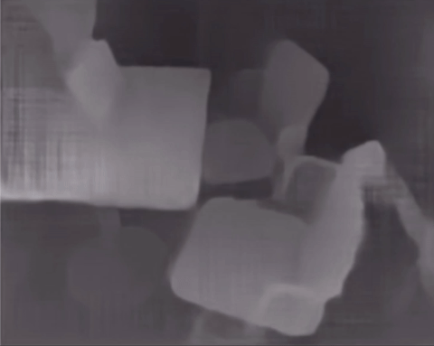

# Code: Multi-view Stereo by Temporal Nonparametric Fusion
[Yuxin Hou](#) · [Juho Kannala](https://users.aalto.fi/~kannalj1/) · [Arno Solin](http://arno.solin.fi)

Codes for the paper:

* Yuxin Hou, Arno Solin, and Juho Kannala (2019). **Multi-view stereo by temporal nonparametric fusion**. *International Conference on Computer Vision (ICCV)*. Seoul, Korea. [[arXiv](https://arxiv.org/abs/1904.06397)] [[video](https://www.youtube.com/watch?v=iellGrlNW7k)] [[project page](https://aaltoml.github.io/GP-MVS/)]

## Summary

We propose a novel idea for depth estimation from unstructured multi-view image-pose pairs, where the model has capability to leverage information from previous latent-space encodings of the scene. This model uses pairs of images and poses, which are passed through an encoder-decoder model for disparity estimation. The novelty lies in soft-constraining the bottleneck layer by a nonparametric Gaussian process prior.



*Example depth estimation result running in real-time on an iPad.*

## Prerequisites

* Python3
* Numpy
* Pytorch 0.4.0
* CUDA 9 (You can also run without CUDA, but then you need to remove all  `.cuda()` in codes)
* opencv
* tensorboardX
* imageio
* path.py
* blessings
* progressbar2

## Training

As we mentioned in our paper, the training use the split pretrained MVDepthNet model as statring point.
Check the [link](https://github.com/HKUST-Aerial-Robotics/MVDepthNet) to get the pretrained model.
```
python train.py train_dataset_path --pretrained-dict pretrained_mvdepthnet --log-output
```

## Testing

For testing run
```
python test.py formatted_seq_path --savepath disparity.npy --encoder encoder_path --gp gp_path --decoder decoder_path
```
Our pretrained model can be downloaded [here](https://drive.google.com/open?id=10n-A2H-Of_1hx5Zdy0V7HXxF24xwaYPN).

## Use your own data for testing

The formatted sequence have the folder structure like this:
* `K.txt`: The txt file stores the camera intrinsic matrix 
* `poses.txt`: The text file stores extrinsic matrixs for all frames in the sequence in order.
* `images`: The folder includes all RGB images(.png), and the images are ordered by name.
* `depth`: The folder includes all ground truth depth map(.npy), and the name is matched with the images'name.

We also provide one example sequence: [redkitchen seq-01-formatted](https://drive.google.com/file/d/1VceP2eYjS25NhtJHAYrFhGRFWhr98k3U/view?usp=sharing).

## Acknowledgements

The encoder/decoder codes build on [MVDepthNet](https://github.com/HKUST-Aerial-Robotics/MVDepthNet). Some useful util functions used during training are from [SfmLearner](https://github.com/ClementPinard/SfmLearner-Pytorch). Most of the training data are collected by [DeMoN](https://github.com/lmb-freiburg/demon). We appreciate their work!

## License

Copyright Yuxin Hou, Juho Kannala, and Arno Solin.

This software is provided under the MIT License. See the accompanying LICENSE file for details.
