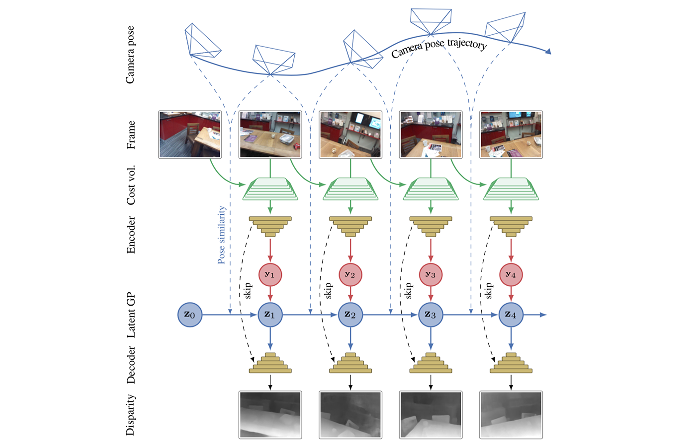

## Multi-View Stereo by Temporal Nonparametric Fusion

We propose a novel idea for depth estimation from unstructured multi-view image-pose pairs, where the model has capability to leverage information from previous latent-space encodings of the scene. This model uses pairs of images and poses, which are passed through an encoder–decoder model for disparity estimation. The novelty lies in soft-constraining the bottleneck layer by a nonparametric Gaussian process prior. We propose a pose-kernel structure that encourages similar poses to have resembling latent spaces. The flexibility of the Gaussian process (GP) prior provides adapting memory for fusing information from previous views. We train the encoder–decoder and the GP hyperparameters jointly end-to-end. In addition to a batch method, we derive a lightweight estimation scheme that circumvents standard pitfalls in scaling Gaussian process inference, and demonstrate how our scheme can run in real-time on smart devices.

*Illustrative sketch of our MVS approach.  The camera poses and input frames are illustrated in the top rows.  The current and previous (or a sequence of previous) frames are used for composing a cost volume, which is then passed through and en-
coder network.  The novelty in our method is in doing Gaussian process inference on the latent-space encodings such that the GP
prior is defined to be smooth in pose-difference.  The GP prediction  is  finally  passed  through  a  decoder  network  which  outputs disparity maps (bottom).  This is the logic of the online variant of our method (the latent space graph is a directed graph / Markov chain).  The batch variant could be illustrated in similar fashion, but with links between all latent nodes.*

### Example video

<iframe width="560" height="315" src="https://www.youtube.com/embed/iellGrlNW7k" frameborder="0" gesture="media" allow="encrypted-media" allowfullscreen></iframe>

This method is capable of running in real-time on a tablet/phone (the video shows how it works on an iPad). The training data was not captured on a similar device, nor environment.

